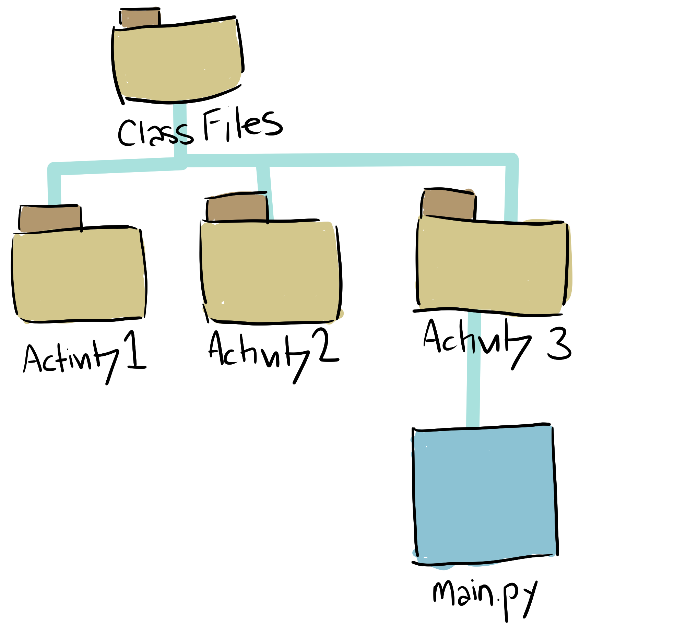
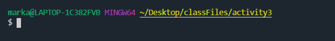
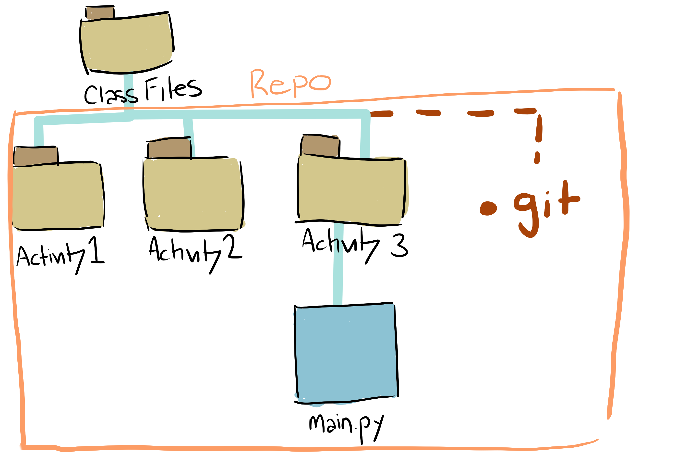
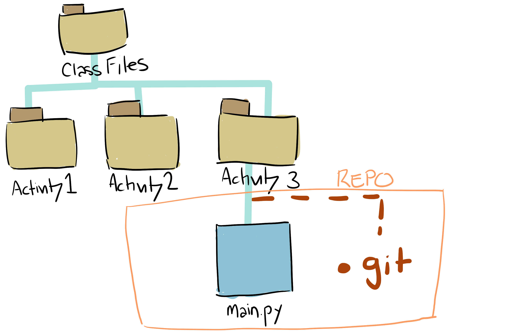
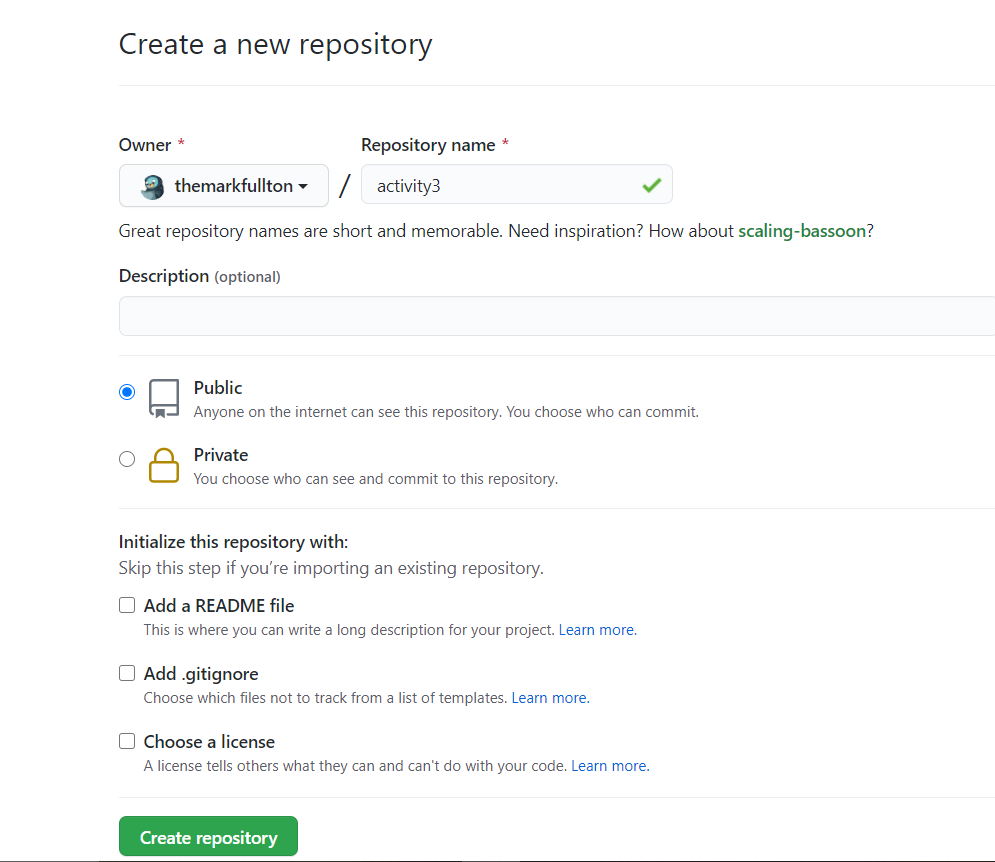
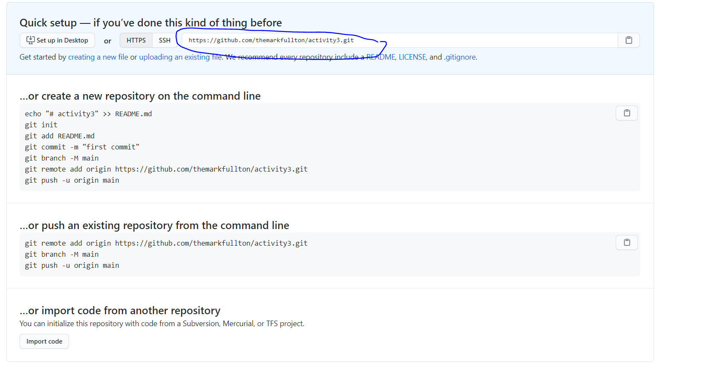
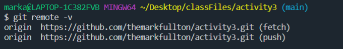
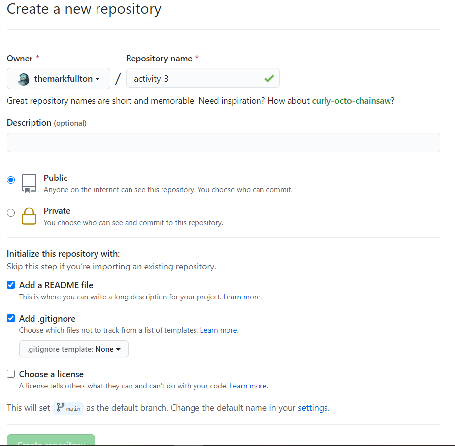
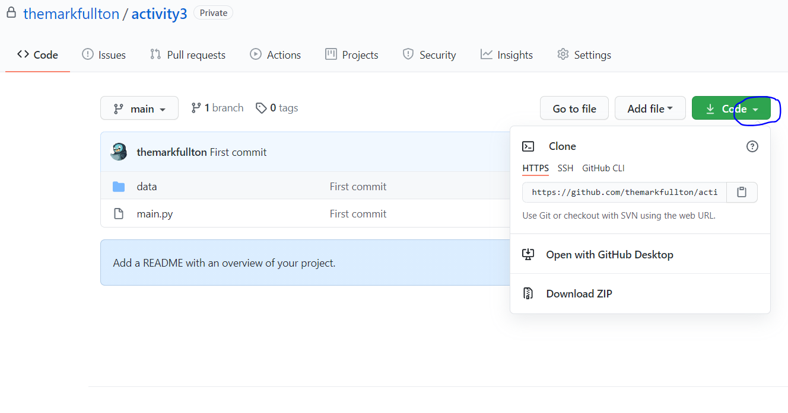

# Creating a Team Repo

<a href="README.md" target="_blank">Git at Work</a> | <a href="GitCommandList.md" target="_blank">Git Cheatsheet</a> | **Git Creating Team Repo** | <a href="GitHubAndRecruiters.md" target="_blank">GitHub and Recruiters</a> | <a href="PullingFromClassGitLab.md" target="_blank">Pulling from Class GitLab</a>

## There are two common ways to add a repo to GitHub. The way you should use depends on if you already have files on your computer.

### If you have code written already that you would like to add to GitHub...

For example, let's say we want to upload Activity3 to GitHub. We started writing Python code in it before we created the repo.

Here's what our file structure looks like:



Activity3 is located inside our ClassFolder.

**The first step is to navigate inside Activity3 using terminal / gitBash**



This is important because we will be creating a .git file in our current location.

The place that we add the .git file will be where our repo starts.

If we create our .git file, for example, our repo will look like this:



This is bad because we **only** want Activity3 files in our repo.

So we need to create the .git file in the Activity3 folder:



**Once we are in the correct folder, we can create a .git file using the command:**

```
git init
```

You can then double-check whether this was created with the command:

```
ls -a
```

(This command shows all hidden files.)

**Now that we have created our .git file, we need to connect it with GitHub's .git file**

First, we will need to create a repo on GitHub **BUT DO NOT ADD A README OR .GITIGNORE**



Thankfully, GitHub tells us exactly what we have to do--but we'll walk through it here, too.

First, we'll need to grab either the HTTPS (or, if you have an SSH key set up, SSH):



Next, we'll return to terminal/gitBash and use this command (replace ??? with the HTTPS/SSH we copied):

```
git remote add origin ???
```

Basically, this is creating a variable (origin) that holds the value of your HTTPS/SSH link.

To check whether this was added, you can use the command:

```
git remote -v
```



You will see origin has both a (push) and (fetch) version. This is because we use both commands to connect our .git with the GitHub.

```
git push origin main
```

```
git fetch origin main
```

**Now, all we need to do is our three step process of adding files**

```
git add .
git commit -m "First Commit"
git push origin main
```

Upon refreshing, you'll see the files have been added.

### If you have no code written and would like to create the repo first (or if you are pulling a repo a team mate created)...

This is the version we learned in the modules.

(If creating the repo ONLY): We will create our repo, making sure to click ADD READ ME and ADD GITIGNORE.



(If creating repo AND if cloning existing repo) Then we'll get the HTTPS (or, if you have an SSH key set up, SSH):



Now, we just need to clone the repo (replace ??? with the HTTPS/SSH we just copied):

```
git clone ???
```

If you run `ls`, you will see that git clone added a folder. We will need to `cd` into that folder.

**IMPORTANT** When you use `git clone`, git will do both `git init` and `git remote add origin` for you in--inside the folder created by the clone. Do not do either command yourself.

When we cd into the folder, we can check to make sure that it has the .git file and the remote origin set up:

```
ls -a
```

You should see a .git file

```
git remote -v
```

You should see origin for fetch and push.

If you do not see either, it is probably because you did not cd into the folder created by `git clone`.
