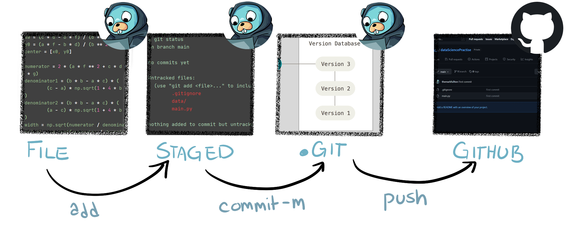
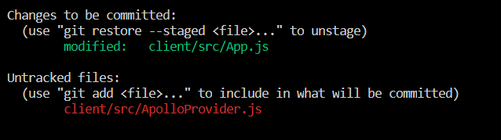
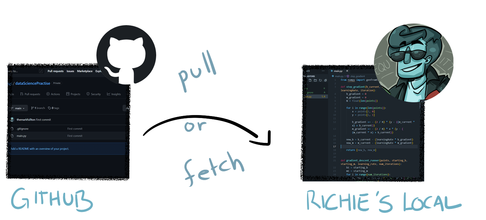
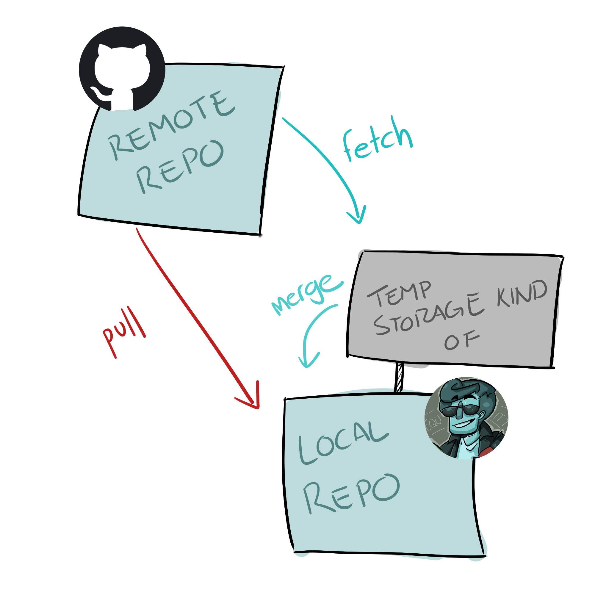
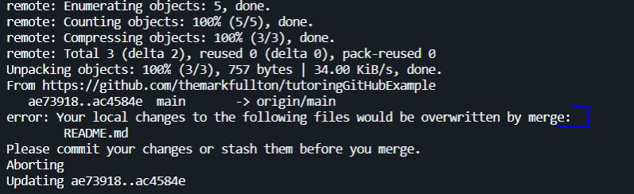
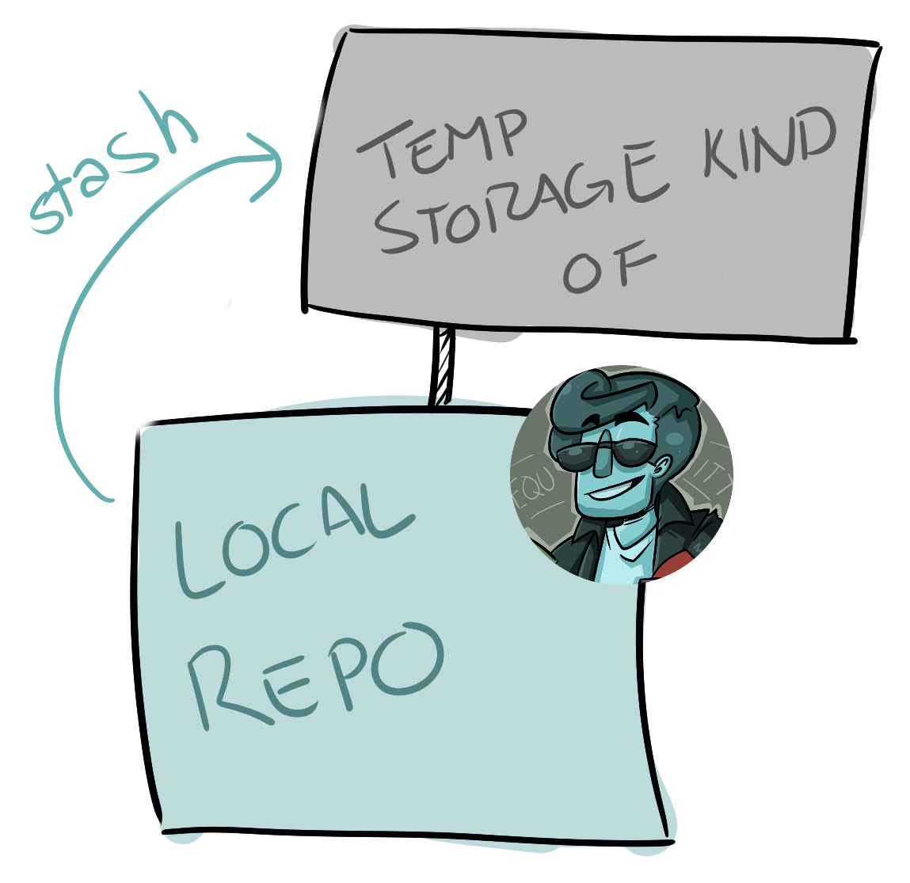

# Git Command Cheat Sheet

<a href="README.md" target="_blank">Git at Work</a> | **Git Cheatsheet** | <a href="CreatingTeamRepo.md" target="_blank">Git Creating Team Repo</a> | <a href="GitHubAndRecruiters.md" target="_blank">GitHub and Recruiters</a> | <a href="PullingFromClassGitLab.md" target="_blank">Pulling from Class GitLab</a>

## If you have a folder with files that you want to add to an empty GitHub repo:

```
git init
```

Replace ??? with the Empty GitHub Repo URL / GitHub Repo URL

```
git remote add origin ???
```

---

## If you want to copy an existing GitHub repo onto your computer

Replace ??? with the Remote Repo URL / GitHub Repo URL

```
git clone ????
```

(This will do `git init` and `git remote add orgin` for you, so you do not have to)

---

---

## Adding Changes From Local Repo (Our Computer) to Remote Repo (GitHub)



### Checking to see which changes need to be moved to staged

```
git status
```



> **Red** This was changed and needs to be added to staged
>
> **Green** This was changed and HAS BEEN added to staged

### File -> Staged

Replace ???? with a file name (main.py) or .

git add . will add all changes

```
git add ???
```

### Staged -> Local .Git file

Replace ??? with an explanation of your changes.

Remember, recruiters will read your commit messages.

```
git commit -m "???"
```

### Local .Git file -> GitHub (Remote Repo)

```
git push origin main
```

**origin** is the name of the remote (Remote Repo URL)

**main** is the name of the branch

---

---

## Remote Repo (GitHub) to Local Repo (Our Computer)





---

### Git Fetch, Diff, Merge

**Storing the Current Remote Repo in our Temporary Storage (Not Computer)**

```
git fetch
```

**Checking to see if Merging the Remote Repo with our repo will cause problems**

```
git diff ...origin
```

**Adding the Remote Repo changes to our Local Repo**

```
git merge
```

---

### Git Pull (Git Fetch + Git Merge)

**Adds Remote Repo changes to our Local Repo without checking if it will cause problems**

```
git pull
```

---

---

## Git will not let us pull because we made changes to files





### Git Stash

Saves our changes in a temporary storage outside of our local repo. Allows us to pull.

Replace ??? with a message that will help you find the stash later.

```
git stash save "???"
```

Then we will need to pull.

```
git pull
```
