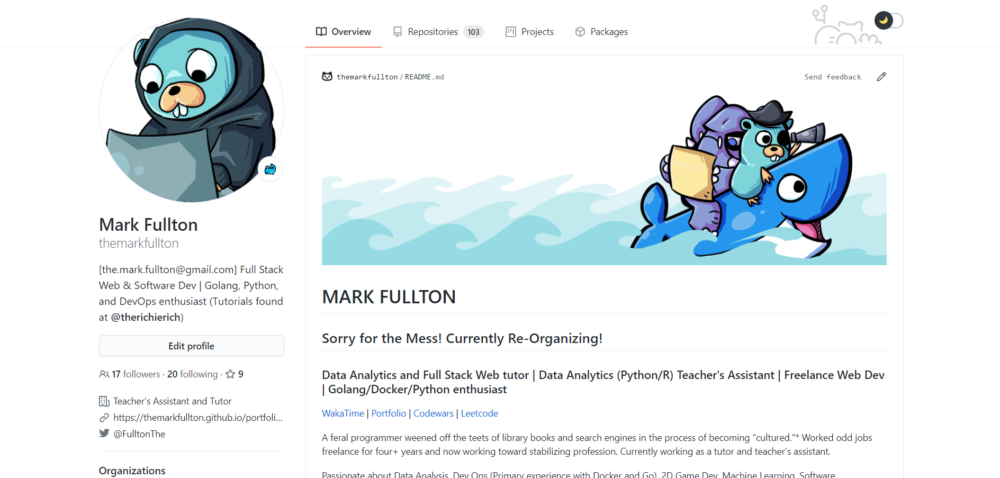
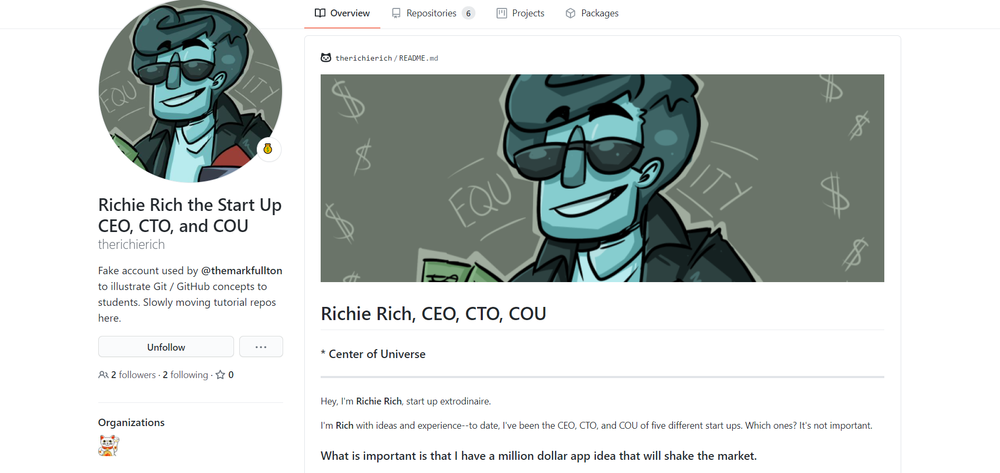
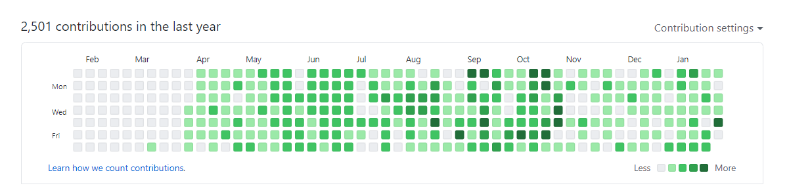
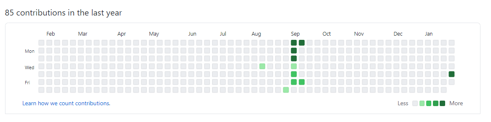
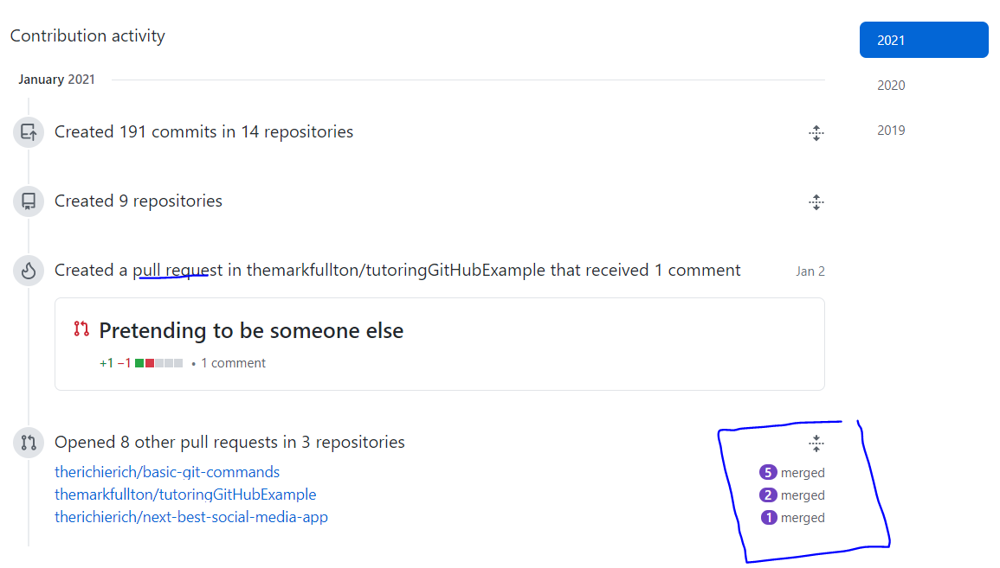
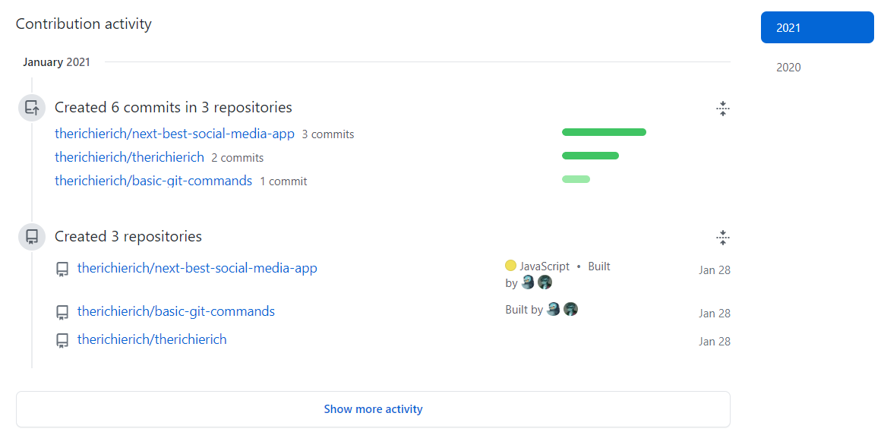
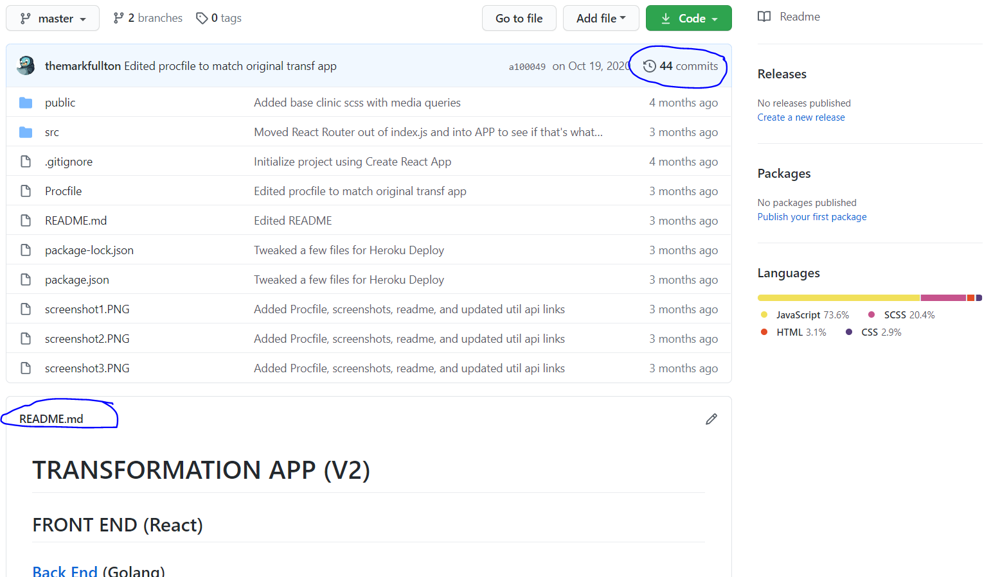
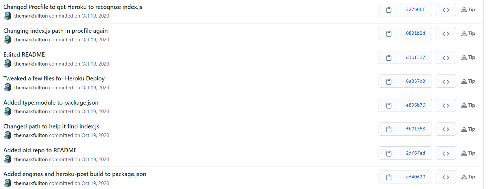
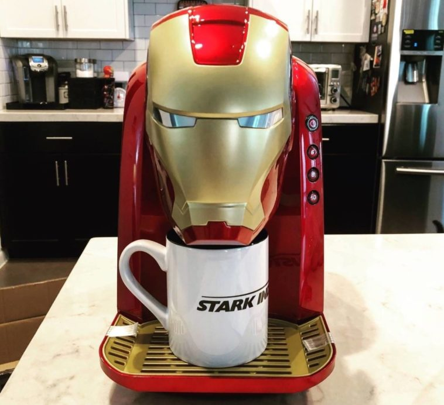

# GitHub and Recruiters

<a href="README.md" target="_blank">Git at Work</a> | <a href="GitCommandList.md" target="_blank">Git Cheatsheet</a> | <a href="CreatingTeamRepo.md" target="_blank">Git Creating Team Repo</a> | **GitHub and Recruiters** | <a href="GitTroubleShooting.md" target="_blank">Common Git Problems</a> | <a href="PullingFromClassGitLab.md" target="_blank">Pulling from Class GitLab</a>

## You're a recruiter for Stark Industries.

### Working for **the** Tony Stark is no cake walk, however. Tony only wants to hire **the best of the best** and your paycheck is based on your ability to recruit the best candidates.

### Right now, you have two candidates for an open position: Mark and Richie (from our "Two dudes and their Keurig Coffee Machine" start up).

### However, you have little to no programming experience yourself so how do you determine which candidates are the best?

## You look at the GitHub profiles of your job candidates.

| **Mark**                                                   | **Richie**                                                   |
| ---------------------------------------------------------- | ------------------------------------------------------------ |
|  |  |

### There are a few things you'll be checking

### ✅ The example projects that have been pinned onto the profile by the user:

As the recruiter, you will actually look at these projects to judge the user's coding abilities. These projects should (1) work and (2) be final drafts.

We can see that Mark has more projects, but several of their projects are **unfinished** and this does not look good for them.

Richie only has two projects, but they are completed and well commented. This looks better for him.

| **Mark**                                                    | **Richie**                                                    |
| ----------------------------------------------------------- | ------------------------------------------------------------- |
|  |  |

### ✅ How often the user codes:

You're not looking for the candidate to have a commit every day. You're just looking for a candidate that codes regularly.

Mark has been coding regularly, but Richie hasn't coded in a while. Mark would win this round.

| **Mark**                                               | **Richie**                                               |
| ------------------------------------------------------ | -------------------------------------------------------- |
|  |  |

### ✅ Recent Activity:

You look in the Contribution Activity section to see whether Mark or Richie has experience coding with other people.

In Mark's Contribution Activity, you can see _merges_ and _pull requests_, which indicate that they often codes with other people.

In Richie's Contribution Activity, you don't see any merges and pull requests, which indicates he usually codes alone. This doesn't disqualify Richie, however.

| **Mark**                                                          | **Richie**                                                          |
| ----------------------------------------------------------------- | ------------------------------------------------------------------- |
|  |  |

### ✅ An Example Project:

You're going to look in both Mark and Richie's Pinned Projects to see a few more things. We'll use one of Mark's projects as an example.

**Number of Commits** A finished project typically has 20+ commits in a recruiter's mind.

**Does the Code Have a README?** As the recruiter, you will use the readme to understand what the code was and what it's results were. If the code does not have a README, it looks unprofessional.

**Are the user's commit messages professional?** When you work with a team, commit messages need to be (1) professional, (2) informative, and (3) uniform.

---

## So who got the job at Stark Industries?

That's right: **THE KEURIG COFFEE MACHINE**:

