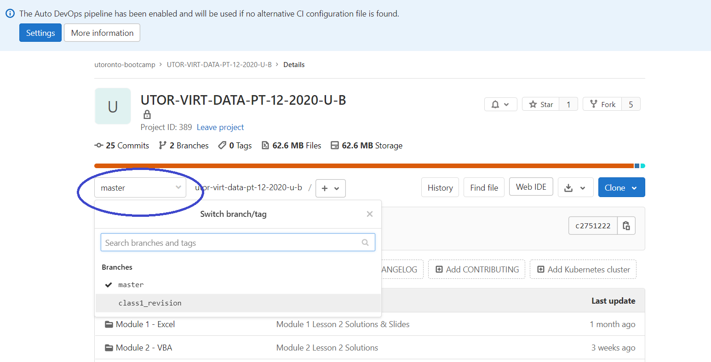

# Pulling From the Class GitLab

<a href="README.md" target="_blank">Git at Work</a> | <a href="GitCommandList.md" target="_blank">Git Cheatsheet</a> | <a href="CreatingTeamRepo.md" target="_blank">Git Creating Team Repo</a> | <a href="GitHubAndRecruiters.md" target="_blank">GitHub and Recruiters</a> | <a href="GitTroubleShooting.md" target="_blank">Common Git Problems</a> | **Pulling from Class GitLab**

## TIRED OF DOWNLOADING EACH AND EVERY FILE FROM THE GITLAB INDIVIDUALLY?

That's part of the reason why we use GitHub and GitLab--they allow us to download and upload **several files** at **quick speeds** using only **a few lines of code**.

### The first thing to remember is that **GitHub** and **GitLab** are two separate hosting platforms.

Your SSH-Keys and passwords on **GitHub** will be different from your SSH-Keys and passwords on **GitLab**.

You will have to set those up separately.

### GitHub vs. GitLab

I think of GitLab as GitHub for rich people.

GitLab lets you have a private Git Repo that you invite people to. It's better for private projects but you have to pay for it.

GitHub is better for open source projects--projects that are open to everyone to see and add to. You can use it for private projects as well, but you have to pay for it.

**We're using GitLab because we only want our class to access the files in our class repository.**

## Branches

The first thing you'll notice when looking at our Class Repository is that we're using branches.

If you click on the dropdown indicated in following picture, it will show you all the branches in our repo

**We have two branches**

- master
- class1_revision

### What is a branch?

Branches are copies of the Remote Repo that are eventually merged back into the main branch.

Ultimately, git is not built for the main / master branch to be changed directly.

That is why Richie had problems when he changed the README and tried to pull.

**Normally, when Richie and Mark clone the Remote Repo, they will also create their own branches (independent copies) of the repo.**

We normally create a branch every time we want to add a new feature (function, file, etc) to code.

When the feature is complete, we then merge our branch into the main branch by using a **pull request**.
