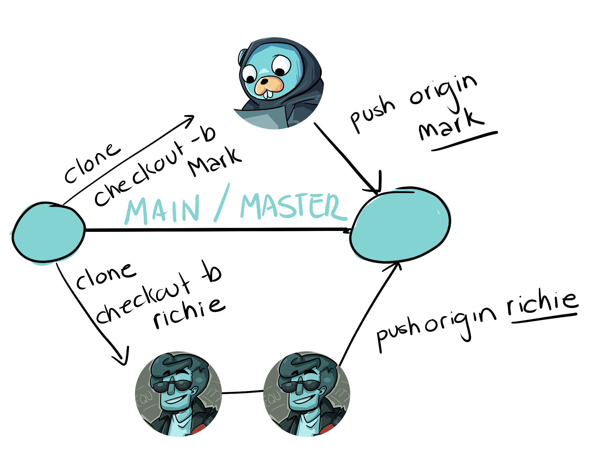
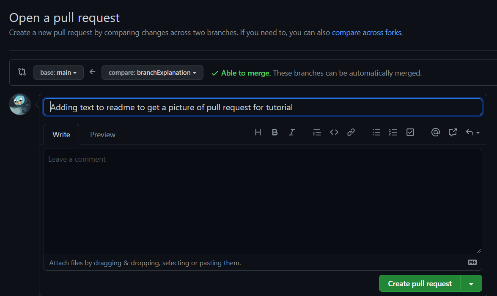
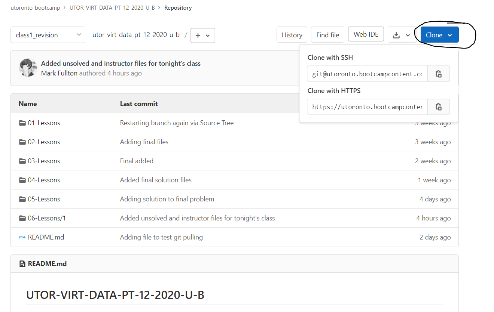
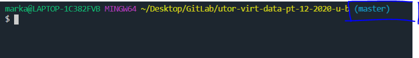
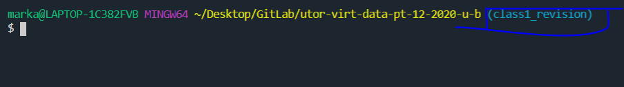

# Pulling From the Class GitLab

<a href="README.md" target="_blank">Git at Work</a> | <a href="GitCommandList.md" target="_blank">Git Cheatsheet</a> | <a href="CreatingTeamRepo.md" target="_blank">Git Creating Team Repo</a> | <a href="GitHubAndRecruiters.md" target="_blank">GitHub and Recruiters</a> | **Pulling from Class GitLab**

## TIRED OF DOWNLOADING EACH AND EVERY FILE FROM THE GITLAB INDIVIDUALLY?

That's part of the reason why we use GitHub and GitLab--they allow us to download and upload **several files** at **quick speeds** using only **a few lines of code**.

### The first thing to remember is that **GitHub** and **GitLab** are two separate hosting platforms.

Your SSH-Keys and passwords on **GitHub** will be different from your SSH-Keys and passwords on **GitLab**.

You will have to set those up separately.

## Super Quick Explanation of Branches

The first thing you'll notice when looking at our Class Repository is that we're using branches.

If you click on the dropdown indicated in following picture, it will show you all the branches in our repo


**We have two branches**

- master
- class1_revision

### What is a branch?

Branches are copies of the Remote Repo that are eventually merged back into the main branch.

Ultimately, git is not built for the main / master branch to be changed directly.

That is why Richie had problems when he changed the README and tried to pull.

**Normally, when Richie and Mark clone the Remote Repo, they will also create their own branches (independent copies) of the repo.**

We normally create a branch every time we want to add a new feature (function, file, etc) to code.



When the feature is complete, we then merge our branch into the main branch by using a **pull request**.



### If that doesn't make sense, don't even worry about it.

## Why are **WE** using two branches?

Because we have two classes and one GitLab repo.

**We're not using branches in the way they are normally used. (Since we're not planning on merging class1_revision branch into master branch)**

Ultimately, each branch is used to hold the files for each class:

**Class 1** uses the class1_revision branch

**Class 2** uses the master branch

## NOW -- LET'S GET THE FILES ONTO OUR COMPUTER

### Cloning the Repo

GitLab and GitHub are different **but** they're both based around git, so cloning the repo onto your computer is similar:



This time, we will want to copy our HTTPS link.

Then we will do the usual (replace ??? with the HTTPS link):

```
git clone ???
```

(This might take a while since there are a lot of files--don't worry!)

As usual, it creates a folder that we'll need to `cd` into.

If you do `ls -a`, you will see the .git file.

If you do `git remote -v`, you will see that remote origin has been set up.

### If you are in class 2, you are finished -- this is master branch and is therefore all of your files: enjoy

### If you are in class 1, there is one more step: We have to change our current branch.

We can do that by using the `git checkout` command:

```
git checkout class1_revision
```

Checkout changes the branch you are currently using. We want to use class1_revision branch.

It might take some time, but your files should change.

### How do I know which branch I am using?

The branch shows up in your terminal!

Using master branch:



Using class1_revision



**IMPORTANT** It is best not to work on the files in the cloned repo. You should copy the files you need from the cloned repo.

If you make changes to a file in the cloned repo and then try to pull changes, Git will not let you pull until you `git stash` your changes... Which means you'll lose all your work until you work through adding the stashed changes back.

And that's a bother.

So it's easiest to have two folders: The one you pull changes from and a copy of this that you add your own code to.

## How to get new files from the GitLab

### Class 1:

```
git pull origin class1_revision
```

### Class 2:

```
git pull origin master
```

## If you have an error, you will probably need to `git stash` before it will let you pull.

### This will remove all the changes you have made to the code (which is why we're recommending to copy the files from the cloned repo into a non-git folder and working on the assignments there)
