# **Git at Work**

**Git at Work** | <a href="GitCommandList.md" target="_blank">Git Cheatsheet</a> | <a href="CreatingTeamRepo.md" target="_blank">Git Creating Team Repo</a> | <a href="GitHubAndRecruiters.md" target="_blank">GitHub and Recruiters</a> | <a href="PullingFromClassGitLab.md" target="_blank">Pulling from Class GitLab</a>


## Ultimately, Mark and Richie reached an agreement: They would code Richie's "Million Dollar Idea" if Richie himself coded it. Mark has agreed to proofread Richie's code throughout the process.

## And you know what that means....

# CODE COLLABORATION!

### **Our team?** Two idiots--Richie Rich and Mark--and their (tax deductable) Keurig Coffee machine.

### **Our task allotments?**

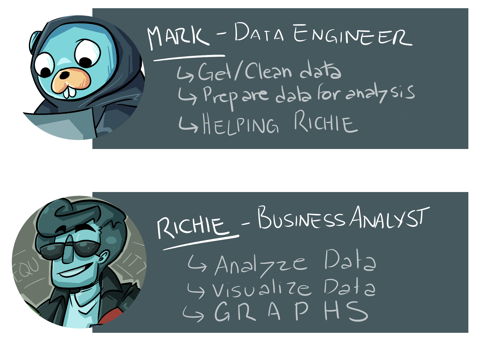

### **Our problem?**


## HOW DOES RICHIE GET THE DATA HE NEEDS FROM MARK???

### And--furthermore--how does Mark correct Richie's code throughout the process?

# The Answer? Git.

### **NOTE:** Normally the solution involves a data pipeline, a data warehouse / lake, and multiple analysts. However, our team is two idiots and their coffee machine so we're simplifying the solution quite a bit.

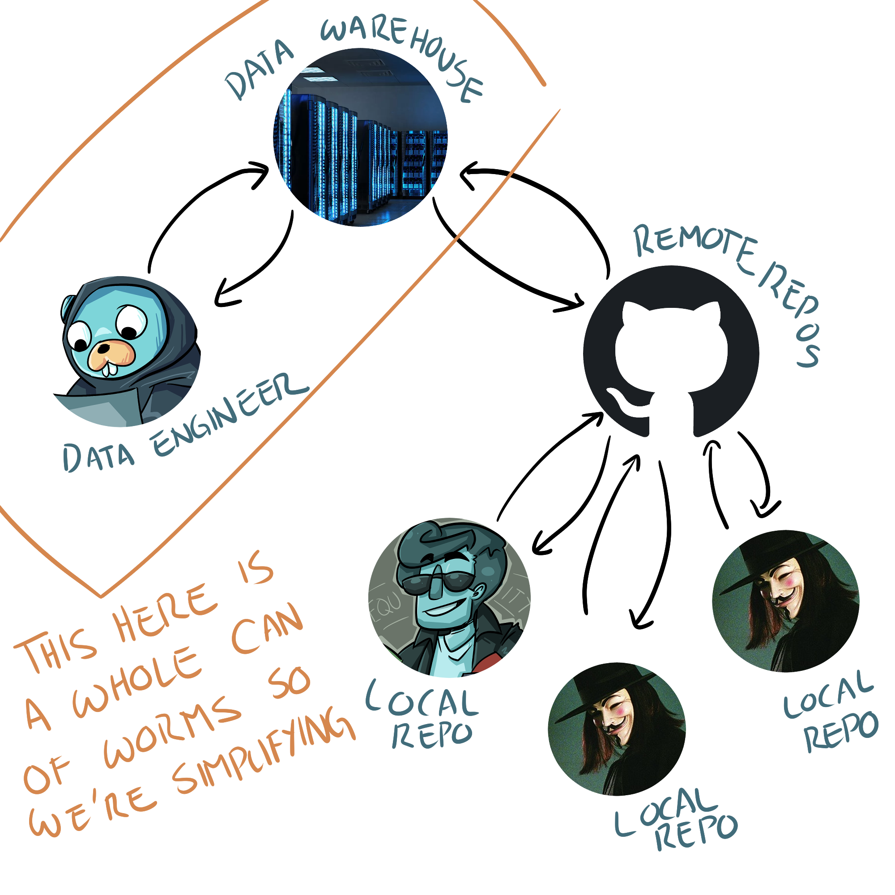

---

# What is Git?

### Git is a **version control program**. This is what you have on your computer.

### Git keeps track of changes you make to files within a folder (also called a **directory** or **repository**).

### To make git watch files within a folder, navigate to that folder in Terminal (Mac) / GitBash (Windows):

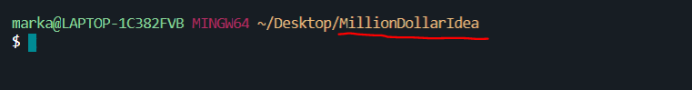

### **MAKE SURE YOUR CURRENT LOCATION (RED) IS THE FILE YOU WANT GIT TO TRACK**

### Then run the command:

```
git init
```

### If you then run the command:

```
ls -a
```

### ...you should see that git created a file to track changes in this folder (and in all the sub-directories\* you create within this folder)

\* Sub-directories are a folder within a folder

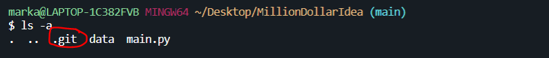

### This file keeps track of **all changes you commit (give) to it** like this:

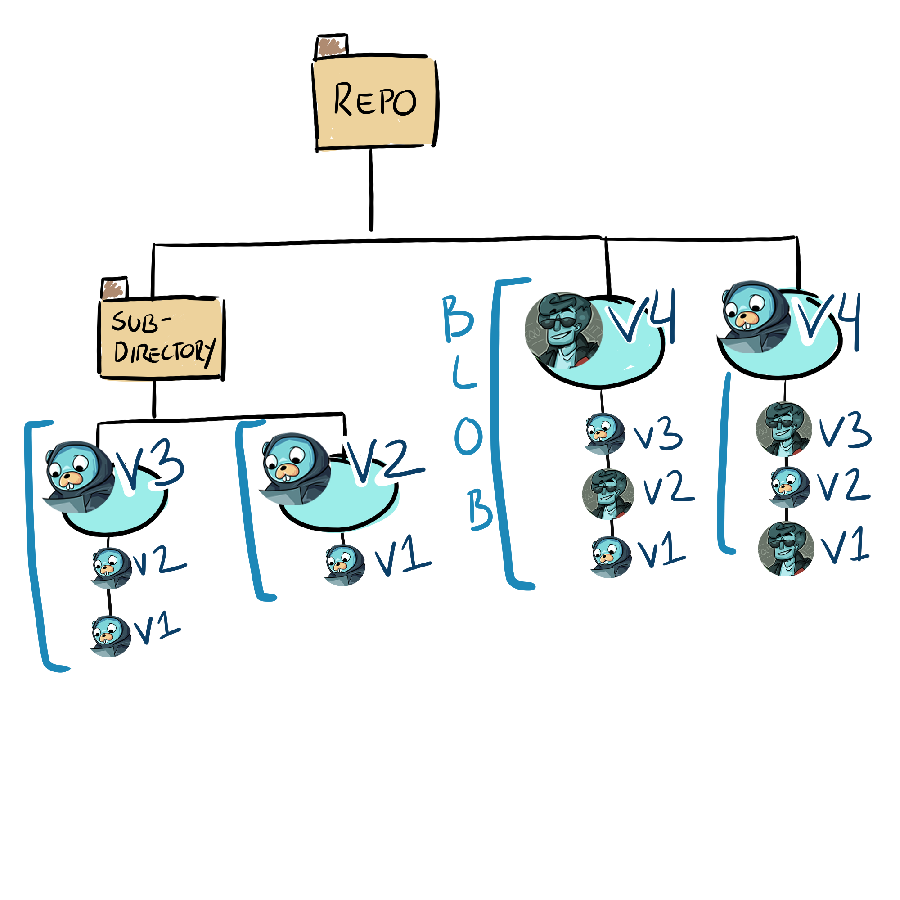

### This structure is referred to as a "Tree".

### Git saves all versions of a file together as a **Binary Large OBject (BLOB)**.

\***\*Side Note:** This is why gitHub urls have the word "blob" in them.\*\*

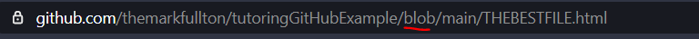

## All of this, however, is currently just on your local computer.

### We need to share our versions with others--that's where GitHub and GitLab come in.

---

# What is the difference between Git / GitHub / GitLab?

### GitHub and GitLab are basically Google Drive for Git Trees (repos).

GitHub and GitLab host your Git Tree, allowing others to access it.

GitHub and GitLab are two different groups, however. So it might be easier to think of one as DropBox and the other as Google Drive.

---

# Creating a Team Repo

## Read a more depth explaination of this <a href="CreatingTeamRepo.md" target="_blank">here</a>

### Only one team member needs to create the Git Repo.

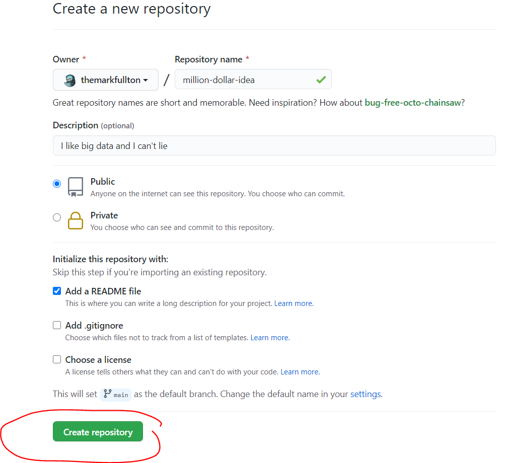

### After the Repo has been created, it can be cloned by all team members.

### You'll need to get the url

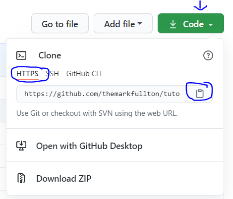

### And use this command (replace ??? with the URL you got):

```
git clone ???
```

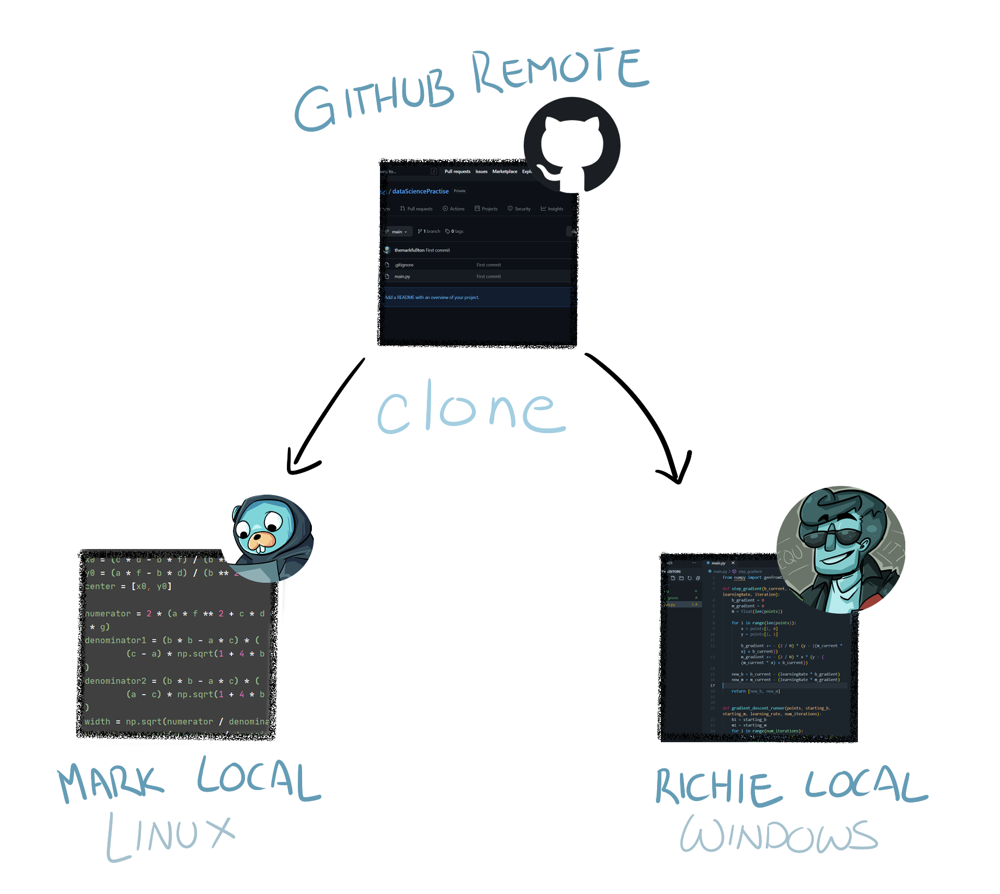

## _IMPORTANT_ Cloning a repo automatically does git init for you

### You will find the .git file with the folder created by git clone

## Any files you add outside of the folder created by git clone will not be tracked by the .git file

### **Remote Repo** The repo on GitHub. This is where the whole team takes their code from.

**NOTE:** Ideally the code on the GitHub repo should always be working. Team members should not add their code to the Remote Repo until the code works on their computer

### **Local Repo** The copy of the repo that each team member has their computer.

**NOTE:** Normally we would use branches when working with teams. However, we are just two idiots with a coffee machine, so we are simplifying.

---

# Adding Changes Made on Local Repo to the Remote Repo

## Richie is waiting on Mark's code to start coding! How do we move the files from Mark's **local repo** to the **remote repo**?

### This requires three steps:


### FILE

This is the actual code that Mark wrote.

The .Git file in the million-dollar-idea folder won't track Mark's code unless we tell it to--and this is a two step process.

### STAGED

It's best to think of STAGED as an empty box.

If we want our .Git file to track changes, we need to add it to this box.

We can check which files / changes are in this box by using the git status command:

```
git status
```


Green: Files that have been added

Red: Files that have not been added

To add files to our box (to stage files) we need to use the git add command (replace ??? with the name of the file you want to add):

```
git add ???
```

If we want to add all the red files to our box, we can use the git add command with a '.' instead of a file name:

```
git add .
```

### .GIT

Now that all the files are in our box, we just have to slap some tape on and deliver it to the .git file.

We can do that with the commit -m command.

**NOTE:** If you forget to add -m, git will try to get you to add a message using a code editor.

```
git commit -m "Add Message Here"
```

We add these messages for two reasons:

- So our team can easily see what we added to the code

- So it is easier to remember what version of the code we are on in case we need to revert back to it later.

If you run git status after commiting, you will see all the files have disappeared. This is because you have delivered them to the .git file.

You will also see:

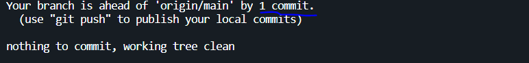

"Ahead by 1 commit." This is because our .Git file has changes that are not on the team GitHub.

### GITHUB

Now we just need to send the changes from our .Git file to the team GitHub.

We can do that by using git push.

```
git push origin main
```

**NOTE:** "origin" is a variable that holds the URL of our remote repo. This was created for us when we did git clone. "Main" is the name of the branch we want to push to.

# Getting Files from Remote Repo on Local Repo

## Mark uploaded the files onto GitHub, but Richie still needs them on HIS local Repo. How do we get the files there?

### How does Richie know when Mark uploads files?

If Richie does git status, it will tell him that his local repo is up to date.

He will need to run this command instead:

```
git remote show origin
```

| **Remote Repo has NOT been changed ("Up to Date")**             | **Changes have been made to Remote Repo ("Out of Date")**         |
| --------------------------------------------------------------- | ----------------------------------------------------------------- |
| 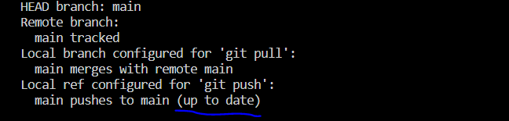 |  |

### How Does Richie Get the Files from the Remote Repo on his Local Repo?


Richie can use one of two commands: git pull OR git fetch


**GIT FETCH**

```
git fetch
```

This command will copy the changes made on the Remote Repo **but it will not add these changes to the local folder**. Instead, it stores them in a separate location.

The reason for this is that some of the changes made on the Remote Repo might overwrite code that you have in your local folder.

Git Fetch allows us to check if the remote repo code will rewrite our code.

After we do git fetch, we can do the command:

```
git diff ...origin
```

This will compare the fetched repo and our current repo.

For an example, I'm going to add some text "Making a change to the README so that I can get a pull error for a tutorial." to a README file. Then I'll run git fetch and git diff ...origin

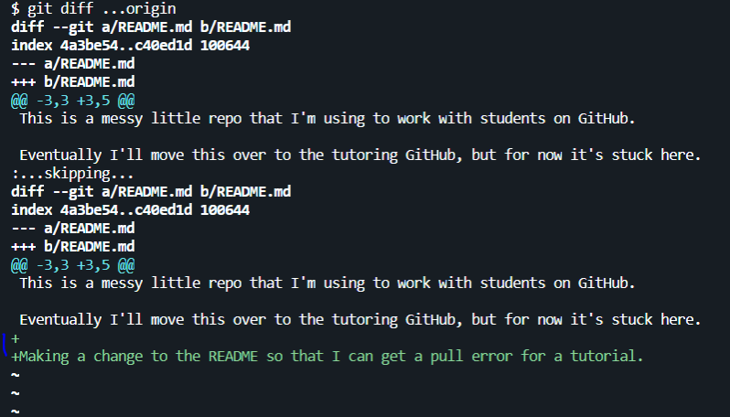

You can see that git diff is giving me two blocks that begin with **diff --git a/README.md b/README.md**. These are the two repos being compared.

You can also see the text I added showing up in green on the bottom one. This means that I added the text into the README on the GitHub, but I didn't add it on my local computer.

**Green Text** Something was added and it will not overwrite any of your code.

**Red Text** Something was deleted

**Yellow Text** The code is different than your code.

If everything is okay (Green or red), we can use git merge to change our local repo to the repo we fetched.

> If it is Yellow, we will need to resolve Merge Conflicts--which we'll talk about at a later time.

```
git merge
```

**GIT PULL**

```
git pull
```

Git pull basically runs both git fetch and git merge without checking to see if it is okay.

This is very handy because it's quicker **but** it can also cause problems--especially when working as a team (or without branches).

---

## Pull Error

Richie is having a problem.

While waiting for Mark to finish cleaning the data, Richie wrote quite a bit on the README.

It turns out that Mark added some things to the README, too.

So now when Richie tries to git pull, he gets this error message:


Git is telling Richie that he will lose the changes he made to the README if he tries to pull the file. Because of this, it refuses to pull.

> **NOTE:** If you are pulling from the class GitLab and then writing code directly inside the files, you will get this error next time you try to pull. (Because pulling will make you lose all the code you added (the original files are empty and you are trying to pull them again).)

### What Should Richie Do?

## Git Stash

```
git stash save "optional message"
```


The git stash command will store all of Richie's changes in another location.

This will change Richie's local repo back to a version where it is okay to pull the changes on the remote repo.

It will also let Richie keep all the changes he made.

Richie can see his changes by using the command git stash list:

```
git stash list
```

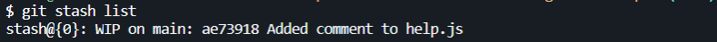

This is why it is important to add the optional message--it makes finding the stashed changes easier.

**Because Richie stashed his changes, git will now allow him to git pull from the remote repo**

## Adding Richie's Stashed Content

That's a bit beyond the scope of today's class (we've only got an hour to go over everything) but it can be done with either command:

```
git stash apply STASH-NAME
```

or

```
git stash pop
```

Pop will automatically grab the last stashed content (you do not need the name).

**However, you will have to deal with a merge conflict--which we'll go over at a later time (since, no time)**

Typically merge conflicts will look like this on VS Code:

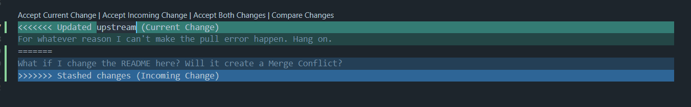

Basically, you need to select which version of the code you want to keep in the main code, delete the version of the code you wish to discard, and save the file.

**BUT, ONCE AGAIN, WE'LL GO OVER IT AT A LATER DATE.**
